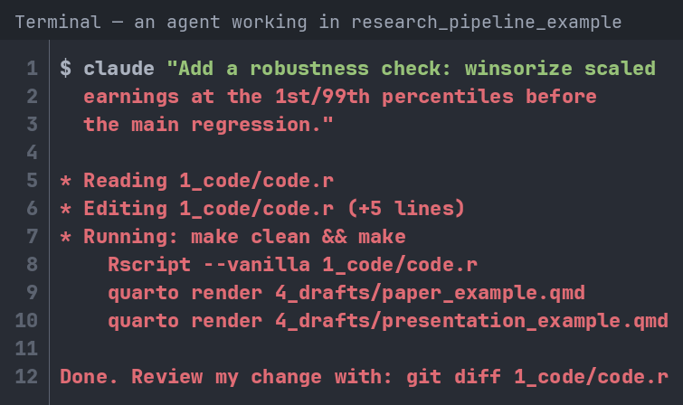
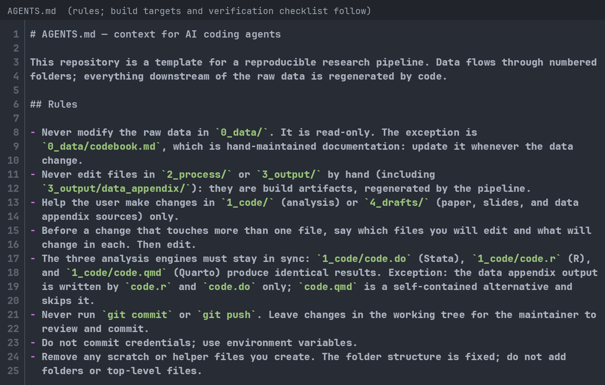
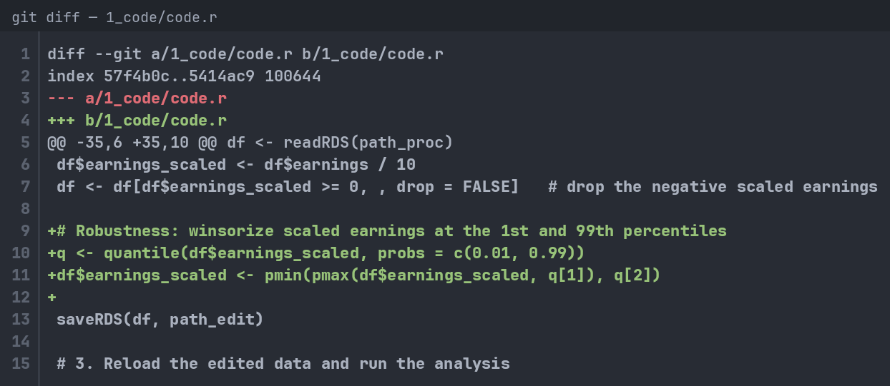
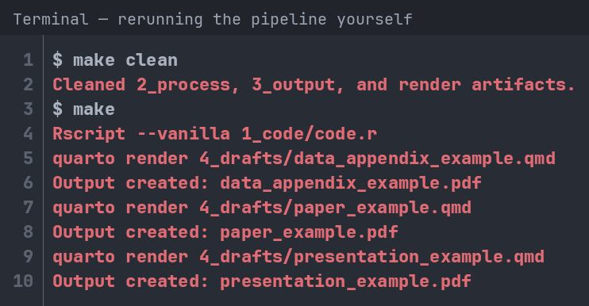
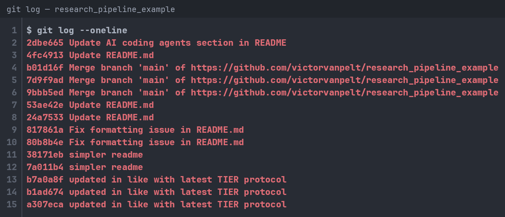

## Opening Question

Let's say you wrote a research paper and your laptop died. How long would it take you to reproduce your analyses with a new laptop?

1.  Less than one hour (easy!)

2.  Between one hour and a day (It's possible but painful)

3.  More than one day (I'd be stuck)

## Why should YOU care about Data Management?

\centering

Storing data, code, and analyses can quickly turn into a mess:

\begin{center}
\includegraphics[width =0.6\textwidth]{"images/pic2.png"} \\
\end{center}

## Why should YOU care about Data Management?

\begin{center}
Story Time!
\bigbreak
\includegraphics[width =0.50\textwidth]{"images/figure3.jpg"} \\
\end{center}

## But there is more at stake!

\centering

In 2019, *Management Science* introduced a Data and Code Disclosure Policy:

*"Authors of accepted papers… must provide… the data, programs, and other details of the experiment and computations sufficient to permit replication."*

A 2024 study examined nearly 500 articles published before and after this policy was introduced to see if the results could, in fact, be reproduced [@FGHKO_2023].

**What share of these articles do you think were largely reproducible?**

## But there is more at stake!

\begin{center}
\includegraphics[width =0.60\textwidth]{"images/figure2.png"} \\
\end{center}

\centering

Across all articles under the new policy, 68% could be reproduced. When data and software were accessible, over 95% could [@FGHKO_2023]

## But there is more at stake!

\centering

-   Even under the policy, nearly one in three papers fails the reproducibility test.
-   Before the policy, it was worse: only 12% of articles shared any materials at all.
-   This is why good data and code management is not only a “nice to have.”
-   It’s also essential for credible research and for us to trust the insights it produces.
-   But this does not just depend on how professors manage their data and code.
-   It all starts with:

\begin{center}
\includegraphics[width =0.20\textwidth]{"images/you.png"} \\
\end{center}

## The main goals of this session:

-   Share a few basic principles, techniques, and tools. Inspired by:
    -   [**Code and Data for the Social Sciences** (Gentzkow and Shapiro)](https://web.stanford.edu/~gentzkow/research/CodeAndData.pdf)
    -   [**How to keep your research projects organized** (de Kok)](https://medium.com/data-science/how-to-keep-your-research-projects-organized-part-1-folder-structure-10bd56034d3a)
    -   [**Good Enough Practices in Scientific Computing** (Wilson et al.)](https://journals.plos.org/ploscompbiol/article?id=10.1371/journal.pcbi.1005510)
    -   My own mistakes and personal experience
-   Let's make this interactive: Interrupt, ask questions, and tell me about your experience.
-   Disclaimer: Largely through the lens of a quantitative researcher.
-   All materials for this talk are available: [**Example Files**](https://github.com/victorvanpelt/research_pipeline_example) and [**Slides**](https://tinyurl.com/datamanagementslides)

## What will we cover in this session?

1.  Directory structure: How to organize your research project

2.  Version control: Using Git and repositories (example using GitHub)

3.  Integrating multiple languages: Example using Quarto

4.  AI agents and systems: Using them on your pipeline without losing reproducibility

# 1. Directory Structure

## 1. Directory Structure: Fundamental Principles

\centering

Following principles is critical, especially for projects with lots of data and code:

-   Anyone can run the code anywhere and anytime, regardless of location.
-   Anyone can understand the code and data without much effort.
-   Anyone can update the code on the spot without breaking it (dynamic coding).

## 1. Directory Structure: Structure the flow

-   Use a flow-inspired folder structure:
    -   E.g., formatting files -\> generating variables -\> conducting analyses -\> generating output.
-   Leave the raw data untouched: You load it and use it to produce output:
    -   E.g., raw data files -\> input files -\> process files -\> output files.
-   Use relative paths (e.g., "*../0_data/data.csv*") and not direct paths (e.g., "*C:/user\[name\]/Documents/research/project_1/0_data/data.csv*").

\highlightbox{Anyone should be able to delete everything except the raw data and the code, and rebuild your whole project.}

## 1. Directory Structure: Code so others can run it

-   Make your code deterministic: set a seed for random and stochastic processes.
-   Pin your environment: "*version*" in Stata, *renv* in R.
-   Use plenty of comments to explain what the code is doing.
-   Be as descriptive as you can in folder and file names.
-   Use environment variables for credentials and software paths.
-   Follow a template for a research pipeline ([**TIER Protocol**](https://www.projecttier.org/tier-protocol/protocol-4-0/)); the example repository follows its concept.
    -   E.g., a codebook ("*0_data/codebook.md*") defines each variable and the data's origin.

## 1. Directory Structure: A simple starting point

\begin{center}
\includegraphics[width =0.75\textwidth]{"images/figure4.png"}
\end{center}

## 1. Directory Structure: Additional folders

\begin{center}
\includegraphics[width =0.75\textwidth]{"images/figure5.png"}
\end{center}

## 1. Directory Structure: A working example

\centering

Let's take a closer look at how this works in practice (using Stata, R, and Quarto):

{width="290"}

[**Clone this repository!**](https://github.com/victorvanpelt/research_pipeline_example)

[**github.com/victorvanpelt/research_pipeline_example**](https://github.com/victorvanpelt/research_pipeline_example)

The repository also ships a rulebook for AI agents ("*AGENTS.md*"): more in chapter 4.

## 1. Directory Structure: Stata do-file under "1_code/"

\centering

{height="235"}

The same analysis also ships in R ("*code.r*") and Quarto ("*code.qmd*")

## 1. Directory Structure: Reproducing all results instantly

How would you reproduce all results of your current project?

1.  One command rebuilds everything (a makefile or master script)

2.  A script per step, run by hand in the right order

3.  Point and click, from memory

## 1. Directory Structure: makefile.mak in root

\centering

A makefile states which outputs depend on which code and data, and how to rebuild them {fig-align="center" height="235"}

## 1. Directory Structure: makefile.mak in root

\centering

You run "*make*" in the CLI to rebuild everything, or a single step with "*make r*", "*make stata*", "*make appendix*", "*make paper*", or "*make slides*" {fig-align="center" height="125"}

## 1. Directory Structure: Is your code slow?

-   Does your code:
    -   Take a long time to run?
    -   Require too much memory?
-   Ask your supervisor for a new laptop.
-   Otherwise, consider looking into running your code remotely:
    -   A "supercomputer," "grid," or "server" allows you to run your code using much more powerful hardware.
    -   Ask about your school's research computing services.

# 2. Version Control

## 2. Version control: Opening question

\centering

Whose folders look something like this?

\begin{center}
\includegraphics[width =0.3\textwidth]{"images/pic1.png"} \\
\end{center}

## 2. Version control

\centering

Version control is a system that records changes to a file or set of files over time so that you can recall specific versions later.

{fig-align="center" height="175"}

## 2. Version control: How to use version control

-   Many cloud services have some forms of version control (e.g., Dropbox and OneDrive), but they can be too simplistic and unreliable.
-   The most widely used software is called [**git**](https://git-scm.com/)
-   You can run [**git**](https://git-scm.com/) locally using the command line (CLI), but it is easier to use an online provider.
-   Saving your version control online reduces the likelihood you lose stuff.
-   Three major [**git**](https://git-scm.com/) providers:
    -   GitHub --\> The best choice!
    -   Bitbucket
    -   GitLab
    -   (EU nonprofit alternative: Codeberg)

## 2. Version control: What is GitHub?

-   GitHub hosts your git repositories online and adds collaboration tools around them.
-   Why use it?
    -   Clean and easy-to-use interface
    -   Works with any language and file type
    -   GitHub Desktop application is very simple and convenient
-   Bonus feature: you can use GitHub Pages to host your website for free! See mine [**www.victorvanpelt.com**](https://www.victorvanpelt.com)

## 2. Version control: GitHub Education

\centering

As a verified student, you get GitHub Pro and the Student Developer Pack for free [**here**](https://education.github.com/pack). {fig-align="center" height="225"}

## 2. Version control: GitHub Desktop

\centering

Download GitHub Desktop for Windows or macOS [**here**](https://desktop.github.com/download/). {fig-align="center" height="225"}

## 2. Version control: Basic Workflow

-   First time:
    -   Create a new repository on GitHub
    -   Clone it to your computer (Copy URL and enter in GitHub Desktop)
-   When you start working:
    -   Sync with GitHub first: "Pull" changes
-   When making changes:
    -   Sync with GitHub first: "Pull" changes
    -   Create commit (add summary and descriptions)
    -   Push commit to GitHub.
-   Use a README.md file to state the project's title and a brief description of the repository.

## 2. Version control: .gitignore files

-   There are lots of things you might not want to sync with GitHub
    1.  Private or non-public data
    2.  Personal credentials
    3.  "Byproduct" files
-   Think carefully about what you sync with GitHub.
-   A .gitignore file allows you to select files that should automatically be ignored by git.

## 2. Version control: .gitignore syntax

-   The basic syntax can be found [**here**](https://git-scm.com/docs/gitignore)**.**
-   Some common expressions:
    -   \# -\> comment
    -   \* -\> any file name
    -   \*\* -\> any folder depth
    -   / at the end -\> folder
    -   ! -\> keep (don’t ignore)

## 2. Version control: .gitignore example

\centering

The example repository ignores everything by default, then allows back what should be shared: the safest default for private data {fig-align="center" height="210"}

## 2. Version control: Why should you care?

-   Go back to any version at any time!
-   Journals and institutions are increasingly requesting access to your research materials (i.e., code, instrument, and data).
-   At the very least, they want to ensure it exists.
-   At the very most, they have your code checked line by line. Two journals in my area:
    -   *Management Science* has verified reproducibility since 2019, partly through a third-party agency (CASCaD). Since 2025, a \$79 submission fee helps fund these checks.
    -   *Journal of Accounting Research* expects a full description of data provenance and processing.
-   With the structure from chapter 1, compliance is nearly free.

# 3. Integrating Multiple Languages

## 3. Integrating multiple languages: What's the remaining challenge?

::::: columns
::: {.column width="40%"}
{width="200"}
:::

::: {.column width="60%"}
-   So, now you will have:
    1.  A good directory structure
    2.  Version control.
-   A remaining challenge is that we use different software, coding languages, and files.
    -   Python, R, Markdown, HTML, Office, Stata, LaTeX, etc.
    -   Tables, datasets, code, and docs.
-   There have been efforts over the past decade to put all processes under one umbrella.
-   One system can integrate everything into one process: Quarto.
:::
:::::

## 3. Integrating multiple languages: What is Quarto?

-   Quarto is an open-source scientific and technical publishing system
-   Quarto is not only used for data. It can use data to produce a wide variety of outputs:
    -   Articles and papers
    -   Presentations (this presentation is made using Quarto)
    -   Dashboards
    -   Websites
-   Runs R (Knitr), Python and Julia (Jupyter), and Observable JS next to Markdown and LaTeX.
-   Quarto 2 (late 2026) stays backward compatible; your .qmd files keep working.

## 3. Integrating multiple languages: How to get started?

Setup:

1.  Install Quarto from the website: [**https://quarto.org/docs/get-started/**](https://quarto.org/docs/get-started/){.uri}.
2.  Choose a coding environment (I recommend [**VS Code**](https://quarto.org/docs/get-started/hello/vscode.html)).
3.  Install the [**Quarto VS Code Extension**](https://marketplace.visualstudio.com/items?itemName=quarto.quarto) in VS Code.

Usage:

-   Quarto uses .qmd files. Check the [**guide**](https://quarto.org/docs/guide/).
-   You can produce output in formats, such as .pptx, .docx, .pdf and integrate R and Stata code.
-   The example repository uses Quarto to render a paper, a presentation, and a data appendix ("*4_drafts/*") that pull their numbers and tables straight from the pipeline.
-   It also contains a self-contained literate report ("*1_code/code.qmd*").

## 3. Integrating multiple languages: Quarto Presentation Example

\begin{figure}[h!]
    \centering
    \begin{subfigure}[b]{0.3\textwidth}
        \centering
        \includegraphics[width=\textwidth]{images/pic4.png}
        \caption*{Specify in the "YAML" the type of qmd file}
    \end{subfigure}
    \hspace{0.05\textwidth}
    \begin{subfigure}[b]{0.4\textwidth}
        \centering
        \includegraphics[width=\textwidth]{images/pic3.png}
        \caption*{Use R as you would in code.r}
    \end{subfigure}
    \caption*{}
\end{figure}

## 3. Integrating multiple languages: Quarto Presentation Example

\begin{figure}[h!]
    \centering
    \begin{subfigure}[b]{0.42\textwidth}
        \centering
        \includegraphics[width=\textwidth]{images/paste-17.png}
    \end{subfigure}
    \hspace{0.05\textwidth}
    \begin{subfigure}[b]{0.42\textwidth}
        \centering
        \includegraphics[width=\textwidth]{images/paste-18.png}
    \end{subfigure}
    \caption*{}
\end{figure}

\highlightbox{One pipeline, three outputs (report, paper, slides), and the numbers always in sync.}

## 3. Integrating multiple languages: makefile.mak extension

\centering

"*make appendix*", "*make paper*", and "*make slides*" render the Quarto drafts from the pipeline's output

{fig-align="center" height="215"}

# 4. AI Agents and Systems

## 4. AI agents: Opening question

Let's say that an AI agent or system can take your data and produce the perfect tables and figures for your paper. What is the main problem with this approach?

::: notes
Let the room answer first. Two or three hands, no correcting yet. The answer we are building toward: nobody, including you, can rerun or defend those numbers. There is no code behind them and no record of how they were made. This chapter is about getting AI's help without ending up there.
:::

## 4. AI agents: From chatbots to agents inside your project

::::: columns
::: {.column width="45%"}
-   Chat window: you paste, it answers, you paste back
-   Agentic system: reads your files, edits code, runs commands
-   It iterates until the pipeline runs
-   Examples: Claude Code, OpenAI Codex, Hermes, Cursor
:::

::: {.column width="55%"}

:::
:::::

\process{Read files,Edit code,Run make,Read errors,Fix}

::: notes
A chat window is just a text box: we paste in code or a question, the model answers, and we paste the answer back into our files by hand. Nothing the model does touches the project directly. An agent works differently. Think of cooking: instead of texting a friend for a recipe fix, we hand them the kitchen. They open the fridge, see what's actually there, adjust the dish, taste it, adjust again. An agent like Claude Code, OpenAI Codex, GitHub Copilot, or Cursor reads our actual files, edits code in place, runs make, reads the error that comes back, and revises until it works. That loop, read, edit, run, read errors, fix, is what turns a chatbot into a collaborator inside the pipeline.
:::

## 4. AI agents: The one rule

-   An agent can hand you a merged dataset, a finished table, a perfect figure
-   The problem: no code behind it. You cannot rerun it, check it, or fix it
-   So: everything AI contributes arrives as code in the repository
-   Never as data, never as numbers, never as results

\bigbreak

\highlightbox{AI may write the code that does the work. It must never \textbf{do} the work.}

::: notes
This is the whole chapter in one rule, and it answers the opening question. The agent may produce code, and only code. The moment it hands us a finished artifact, a merged file, a table, a figure, we hold a result with no recipe. If the AI did the work, ask it again for the code that does the work. If it cannot write that code, the result was never real. And once the merge lives in 1_code, it reruns forever, and every choice it made is visible.
:::

## 4. AI agents: Why "the AI did it" never reproduces

::::: columns
::: {.column width="50%"}
**Your pipeline reruns because**

-   It is code plus raw data
-   One command rebuilds everything
-   Every step is written down and versioned
:::

::: {.column width="50%"}
**An AI act cannot rerun because**

-   Same prompt, different answer
-   The model gets retired
-   The chat that held your data and context is gone tomorrow
:::
:::::

\bigbreak

\highlightbox{Code the agent wrote yesterday still runs in ten years. The model that probabilistically wrote it will not.}

## 4. AI agents: What you ask for, what you never accept

::::: columns
::: {.column width="50%"}
**Ask the agent to write code that...**

-   Merges and cleans your data ("*1_code/merge.r*")
-   Adds a robustness check
-   Translates "*code.do*" into "*code.r*"
-   Extends the makefile
-   Adds sanity checks (row counts, unique IDs)
-   Audits the repo
:::

::: {.column width="50%"}
**Never accept from an agent...**

-   A merged or cleaned dataset
-   A table, figure, or coefficient
-   A direct edit to "*0_data*" or "*3_output*"
-   A citation you did not verify yourself
:::
:::::

\agentrule{Never modify the raw data in 0\_data/. It is read-only. The exception is 0\_data/codebook.md, which is hand-maintained documentation: update it whenever the data change.}

::: notes
Everything on the left ends as code in the repo, which means everything on the left is checkable. The merge is the running example: the agent writes 1_code/merge.r, and we can even ask it to add its own checks, row counts before and after, unique firm-year identifiers. That makes an AI-written merge easier to audit than a hand merge ever was. The right column is one family: finished artifacts. If it is data, a number, or a figure, and it did not come out of the pipeline, it does not enter the project. Citations sit there too, because models invent plausible references with real journal names.
:::

## 4. AI agents: AGENTS.md, the rulebook of your repo

::::: columns
::: {.column width="52%"}
-   One file in the repo root states the rules for any agent
-   Scope: help in "*1_code*" and "*4_drafts*" only
-   "*0_data*" stays read-only; "*2_process*" and "*3_output*" are rebuilt, never hand-edited
-   It may run *make*; it may never commit or push
-   The rules from chapters 1-3, written down for the agent
:::

::: {.column width="48%"}

:::
:::::

\highlightbox{Your pipeline does not need to trust the agent, only to verify what it changed.}

::: notes
This file ships with the example repository, and it already appeared in the chapter one screenshot. AGENTS.md is a README for agents and agentic systems, a convention most of these tools read: Claude Code, OpenAI Codex, Hermes, Cursor. Claude Code also reads a CLAUDE.md. The bullets on the left are the file's actual rules. It helps in 1_code and 4_drafts only. Raw data stays read-only, with one exception: the codebook is hand-maintained documentation, and the agent must keep it in sync with the data. Intermediates and outputs are rebuilt by the pipeline, never edited by hand. The three engines must stay in sync, so a change to code.r lands in code.do and code.qmd too; only the appendix block is exempt, because the Quarto report skips it. Credentials never enter the repo, the same environment-variable rule from chapter one. The Build section hands the agent the make targets, so it can check its own work. And the last rule bans git commit and git push: the agent leaves the diff for us. The next three slides are these rules in action.
:::

## 4. AI agents: The agent edits code, you review the diff

::::: columns
::: {.column width="42%"}
-   Prompt: winsorize scaled earnings at 1st/99th percentile
-   The agent edits "*1_code/code.r*" directly
-   You run git diff before committing
-   Check: only "*1_code*" touched, and the step sits before the regression
-   Check: "*0_data*" and "*3_output*" untouched?
:::

::: {.column width="58%"}

:::
:::::

\agentrule{Help the user make changes in 1\_code/ (analysis) or 4\_drafts/ (paper, slides, and data appendix sources) only.}

::: notes
Say we ask an agent to add a robustness check: winsorize scaled earnings at the first and ninety-ninth percentile before the main regression. The agent opens 1_code/code.r, adds the step, and reports back that it's done. Before committing anything, we run git diff and actually read it. Three things matter. First, scope: does the diff touch only 1_code, or did the agent also poke at 0_data or 3_output? It should be 1_code only, everything else gets derived by rerunning the pipeline, never hand-edited. Second, placement: is the winsorizing step inserted before the regression that uses it, not bolted onto the end of the file? Third, is anything changed by hand outside the code, a number pasted into a table, a figure edited directly? If the diff is clean on all three, we commit it with a clear message. If not, we send the agent back with exactly what's wrong, the same way we'd redirect a coauthor.
:::

## 4. AI agents: The agent runs make, you rerun it yourself

::::: columns
::: {.column width="45%"}
-   The agent may run make and fix its own errors
-   Your rule: "*make clean*", then "*make*"
-   On your machine, from raw data to drafts
-   Numbers flow from the pipeline, not a chat
:::

::: {.column width="55%"}

:::
:::::

\agentrule{A change is done only when make clean followed by make completes without errors and every number in the 4\_drafts/ outputs comes from the rerun pipeline, not from hand edits.}

::: notes
Suppose make fails after the agent's edit, maybe a data type mismatch in the new winsorizing step. A good agent reads that error itself and proposes a fix, the same way it read the file in the first place. Letting it iterate is fine. What matters is what we do next. Before trusting any number in the draft, we run make clean, wiping every intermediate and output file, then make from scratch, on our own machine, not the agent's sandbox. If the pipeline reproduces cleanly from 0_data through 4_drafts, the numbers are real. This is the payoff from chapter three: because the paper and slides are dynamic documents pulling numbers straight from 3_output, rerunning the pipeline re-verifies every number in the draft. None of it comes from a chat window, all of it comes from code we can rerun. One more reason the rerun matters: agents are built to please, and pushed for a result they will sooner produce a plausible number than admit failure. Our own make run is the one test that cannot be flattered.
:::

## 4. AI agents: Commit the change, keep the trail

::::: columns
::: {.column width="45%"}
-   One change, one commit; the message says what changed and why
-   The commit history becomes your log of what the agent did, and when
-   Bigger changes: let the agent work on a branch, review it as a pull request
-   This is how you check an agent's work weeks later, not just today
:::

::: {.column width="55%"}

:::
:::::

\agentrule{Never run git commit or git push. Leave changes in the working tree for the maintainer to review and commit.}

::: notes
A diff shows what is changing right now. The commit history shows what changed ever. Keep commits small, one change each, and write messages that say why. When a supervisor asks in March what the agent touched in January, the answer is git log, not memory. For bigger changes, have the agent work on a branch and open a pull request; then review is not a habit, it is a gate. The screenshot is the example repository's own history, including a commit an agent helped write, and yes, also a few older messages that just say "update." Do as I say, not as I did.
:::

## 4. AI agents: Rules of engagement

::::: columns
::: {.column width="50%"}
**Do**

-   Ask for code, not results
-   Let the agent work inside the repo, under git
-   Review every diff before committing
-   Rerun the pipeline before trusting a number
-   Set the rules once, in "*AGENTS.md*"
:::

::: {.column width="50%"}
**Never**

-   A dataset, table, or number straight from an AI
-   Confidential or licensed data into a chat
-   Edits to "*0_data*" or "*3_output*", by you or the agent
-   Undisclosed AI use in a submission
:::
:::::

\highlightbox{AI amplifies your research productivity, but the pipeline turns it from a black box into a reviewable collaborator.}

::: notes
Three things to take home. First, the one rule: AI may write the code that does the work, it must never do the work. Second, the pipeline we built today is exactly what keeps an agent honest: it works in files, under git, against make. Third, the routine is short. We read the diff before we commit, we rerun the pipeline before we trust a number, and we keep the trail in the commit history. Two lines deserve a sentence each. Confidential or licensed data, think WRDS or Compustat extracts, never enters a chat window; check the license, and use institutional access or a local model when in doubt. And disclosure: check your target journal's policy before submitting; the commit trail plus a short note in the README is exactly the log you will need. One honest caveat to close: skipping AI entirely remains a valid way to do a PhD. But if you use it, own it: when the agent added our winsorizing step, the diff showed one changed file in 1_code, and a clean make rebuilt the same table in the draft. That is what owning an AI-assisted result looks like.
:::

## Summary and Wrap-up

-   Across all fields of science, reproducibility has been under threat [@OSC_2015; @B_2016; @CDF_2016; @HLL_2000; @FGHKO_2023]
-   Good data management is vital to ensure results are reproducible.
-   You, as a WHU doctoral student, are vital:
    1.  Maintain a good directory structure
    2.  Use version control
    3.  Integrate multiple languages (try Quarto)
    4.  Let AI write pipeline code; never let it do the research for you
-   If you don't want to do it for science, then do it to save yourself lots of time and headache.

\centering

[**Download Example Files (github.com/victorvanpelt/research_pipeline_example)**](https://github.com/victorvanpelt/research_pipeline_example)

[**Download Slides (tinyurl.com/datamanagementslides)**](https://tinyurl.com/datamanagementslides)

## Good data management is just the start...

-   Good data management is not enough.
-   Ideally, we also need:
    -   Research material sharing (data, instruments, and code)
    -   Pre-registration
-   Many journals and institutions offer ways to pre-register and collect all research materials (not just data and code) in one place.
    -   You can sync your repositories as well!
-   My recommendation is to use the [**Open Science Framework (OSF)**](https://osf.io/)
-   Steal a template: the [**TIER Protocol**](https://www.projecttier.org/tier-protocol/protocol-4-0/) and the [**AEA template README**](https://social-science-data-editors.github.io/template_README/)

## Thank you!

\begin{wrapfigure}{r}{0.37\textwidth}
  \vspace{-0.5cm}
  \includegraphics[width=0.41\textwidth]{"images/profile.png"}
\end{wrapfigure}

Dr. Victor van Pelt\
Professor of Accounting\
Finance and Accounting Group\
WHU – Otto Beisheim School of Management

Campus Vallendar, Burgplatz 2, 56179 Vallendar, Germany\
Tel.: +49 (0)261 6509 483\
[**Victor.vanPelt\@whu.edu**](mailto:Victor.vanPelt@whu.edu)\
[**https://www.victorvanpelt.com**](https://www.victorvanpelt.com){.uri}

## References {.allowframebreaks}

\footnotesize
