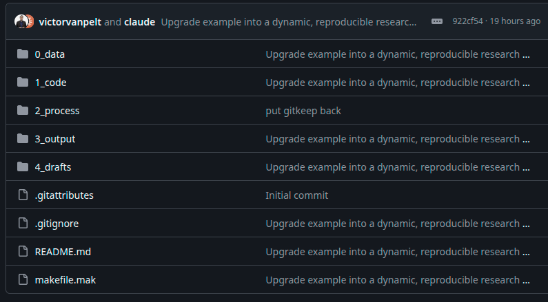
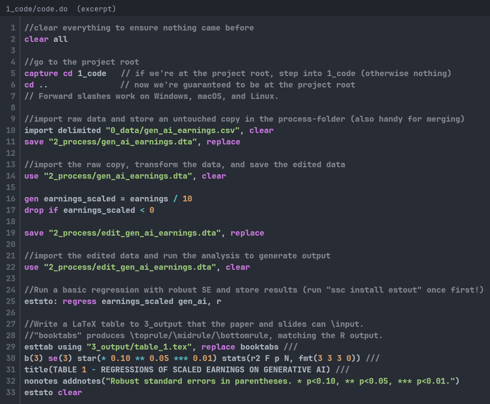
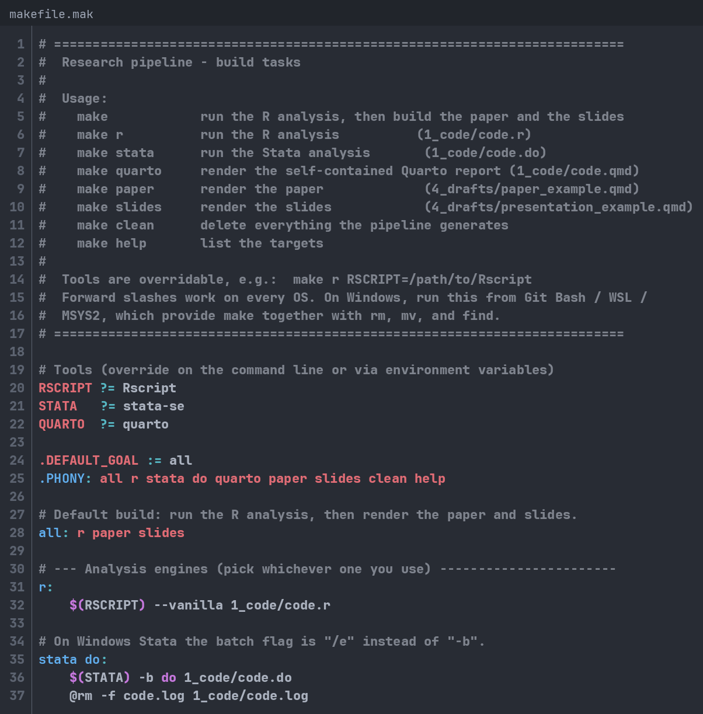
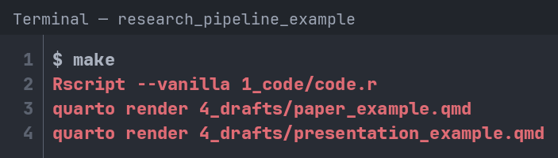
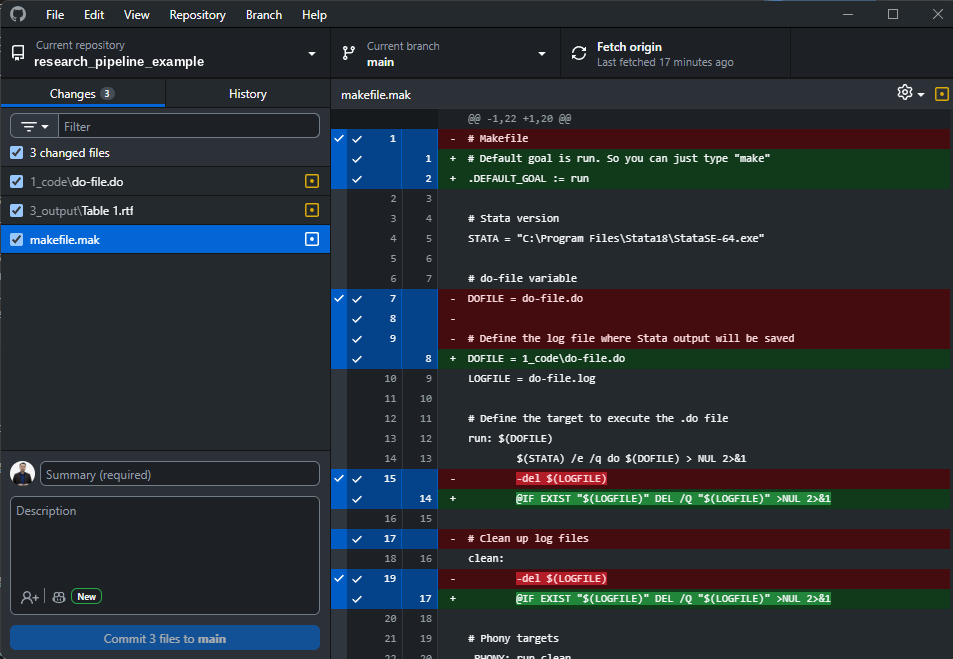
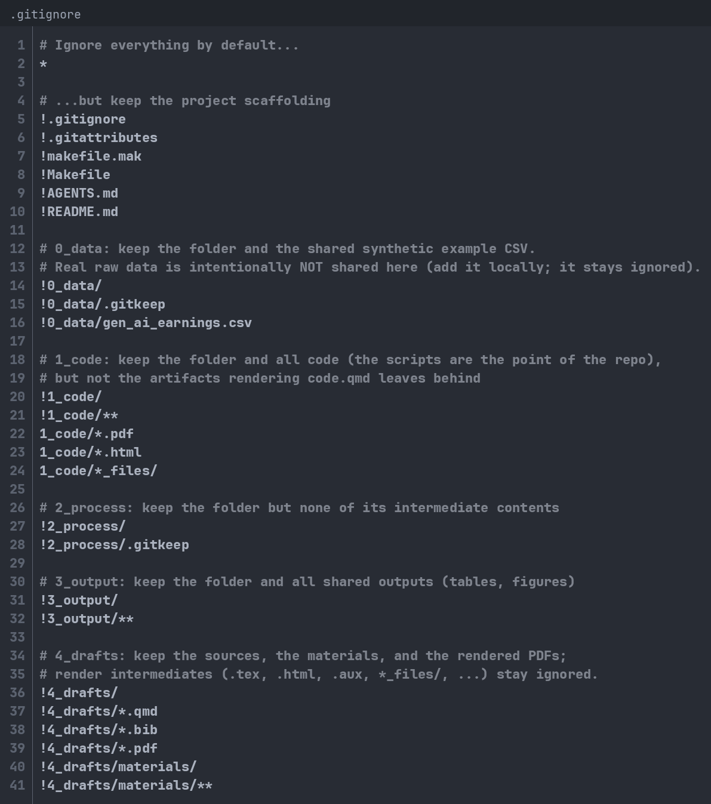
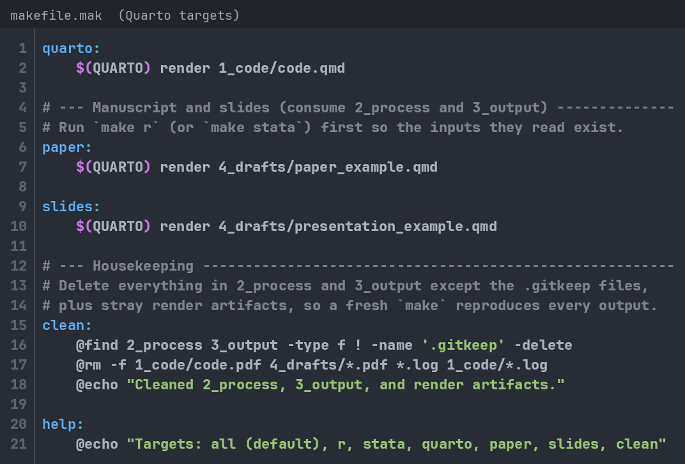

## Opening Question

Let's say you wrote your a research paper and your laptop died. How long would it take you to reproduce your analyses with a new laptop?

1.  Less than one hour (easy!)

2.  Between one hour and a day (It's possible but painful)

3.  More than one day (I'd be stuck)

## Why should YOU care about Data Management?

\centering

Storing data, code, and analyses can quickly turn into a mess:

\begin{center}
\includegraphics[width =0.6\textwidth]{"images/pic2.png"} \\
\end{center}

## Why should YOU care about Data Management?

\begin{center}
Story Time!
\bigbreak
\includegraphics[width =0.50\textwidth]{"images/figure3.jpg"} \\
\end{center}

## But there is more at stake!

\centering

In 2019, *Management Science* introduced a Data and Code Disclosure Policy:

*"Authors of accepted papers… must provide… the data, programs, and other details of the experiment and computations sufficient to permit replication."*

A 2023 study examined nearly 500 articles published under this policy to see if the results could, in fact, be reproduced [@FGHKO_2023].

**What share of these articles do you think were largely reproducible?**

## But there is more at stake!

\begin{center}
\includegraphics[width =0.60\textwidth]{"images/figure2.png"} \\
\end{center}

\centering

About 30% of the articles could not be reproduced, even under the new policy [@FGHKO_2023]

## But there is more at stake!

\centering

-   Nearly one in three papers fails the reproducibility test.
-   This is why good data and code management is not only a “nice to have.”
-   It’s also essential for credible research and for us to trust the insights it produces.
-   But this does not just depends on how professors manage their data and code.
-   It all starts with:

\begin{center}
\includegraphics[width =0.20\textwidth]{"images/you.png"} \\
\end{center}

## The main goals of this session:

-   Share a few basic principles, techniques, and tools. Inspired by:
    -   [**Code and Data for the Social Sciences** (Gentzkow and Shapiro)](https://web.stanford.edu/~gentzkow/research/CodeAndData.pdf)
    -   [**How to keep your research projects organized** (De Kok)](https://medium.com/data-science/how-to-keep-your-research-projects-organized-part-1-folder-structure-10bd56034d3a)
    -   My own mistakes and personal experience
-   Let's make this interactive: Interupt, ask questions, + tell me about your experience.
-   Disclaimer: Largely through the lens of a quantitative researcher.
-   All materials for this talk are available: [**Example Files**](https://tinyurl.com/datamanagementexample) and [**Slides**](https://tinyurl.com/datamanagementslides)

## What will we cover in this session?

1.  Directory structure: How to organize your research project

2.  Version control: Using Git and repositories (example using Github)

3.  Integrating multiple languages: Example using Quarto

## 1. Directory Structure

{fig-align="center" width="300"}

## 1. Directory Structure: Fundamental Principles

\centering

Following principles is critical, especially for projects with lots of data and code:

-   Anyone can run the code anywhere and anytime, regardless of location.
-   Anyone can understand the code and data without much effort.
-   Anyone can update the code on the spot without breaking it (dynamic coding).

## 1. Directory Structure: How to accomplish this?

-   Use a flow-inspired folder structure:
    -   E.g., formatting files -\> generating variables -\> conducting analyses -\> generating output.
-   Leave the raw data untouched: You load it and use it to produce output:
    -   E.g., raw data files -\> input files -\> process files -\> output files.
-   Use relative paths (e.g., "*../0_data/data.csv*") and not direct paths (e.g., "*C:/user\[name\]/Documents/research/project_1/0_data/data.csv*").
-   The code is deterministic. Random and stochastic processes ideally require a seed.
-   Do not leave blindspots in your coding and analysis
    -   Use plenty of comments to explain what the code is doing.
    -   Be as descriptive as you can in folder and filenames
-   Use environmental variables for credentials and software paths

## 1. Directory Structure: An simple starting point

\begin{center}
\includegraphics[width =0.75\textwidth]{"images/figure4.png"}
\end{center}

## 1. Directory Structure: Additional folders

\begin{center}
\includegraphics[width =0.75\textwidth]{"images/figure5.png"}
\end{center}

## 1. Directory Structure: An example for Stata

\centering

Let's take a closer look at how this (in principle) could work:

{width="400"}

[**Clone this repository!**](https://github.com/victorvanpelt/data_management_example)

[**tinyurl.com/datamanagementexample**](https://tinyurl.com/datamanagementexample)

## 1. Directory Structure: Stata do-file under "1_code\\"

\centering

{height="250"}

## 1. Directory Structure: Reproducing all results instantly

\centering

Who can reproduce all their results using a single command or script?

## 1. Directory Structure: makefile.mak in root

{fig-align="center" height="250"}

## 1. Directory Structure: makefile.mak in root

\centering

You run "*make do*" and "*make r*" in the CLI {fig-align="center" height="125"}

## 1. Directory Structure: Is your code slow?

-   Does your code:
    -   Take a long time to run?
    -   Require too much memory?
-   Ask your supervisor for a new laptop.
-   Otherwise, consider looking into running your code remotely:
    -   "super computer,"grid", or "server" allows you to run your code using way more powerful hardware.

## 2. Version control: Opening question

\centering

Whose folders look something like this?

\begin{center}
\includegraphics[width =0.3\textwidth]{"images/pic1.png"} \\
\end{center}

## 2. Version control

\centering

Version control is a system that records changes to a file or set of files over time so that you can recall specific versions later.

{fig-align="center" height="175"}

## 2. Version control: How to use version control

-   Many cloud services have some forms of version control (e.g., Dropbox and Onedrive), but they can be too simplistic and unreliable.
-   The most widely used software is called [**git**](https://git-scm.com/)
-   You can run [**git**](https://git-scm.com/) locally using the CL, but it is easier to use an online provider.
-   Saving your version control online reduces the likelihood you loose stuff.
-   Three major [**git**](https://git-scm.com/) providers:
    -   GitHub --\> The best choice!
    -   BitBucket
    -   GitLab

## 2. Version control: What is Github?

-   GitHub Inc. is a web-based hosting service for version control using Git. It is mostly used for computer code. It offers all of the distributed version control and source code management functionality of Git as well as adding its own features.
-   Why use it?
    -   Clean and easy to use interface
    -   Native support for all kinds of software
    -   GitHub Desktop application is very simple and convenient
-   Bonus feature: you can use GitHub pages to host your website for free! See mine [**www.victorvanpelt.com**](www.victorvanpelt.com)

## 2. Version control: GitHub Enterprise

\centering

You can apply for GitHub Enterprise as a researcher or student [**here**](https://education.github.com/discount_requests/application). {fig-align="center" height="225"}

## 2. Version control: GitHub Desktop

\centering

Download the GitHub Desktop for Windows or MacOS [**here**](https://github.com/apps/desktop). {fig-align="center" height="225"}

## 2. Version control: Basic Workflow

-   First time:
    -   Create a new repository on GitHub
    -   Clone it to your computer (Copy URL and enter in GitHub Desktop)
-   When you start working:
    -   Sync with Github first: "Pull" changes
-   When making changes:
    -   Sync with Github first: "Pull" changes
    -   Create commit (add summary and descriptions)
    -   Push commit to GitHub.
-   Use a README.md file to state the project's title and a brief description of the repository.

## 2. Version control: .gitignore files

-   There are lots of things you might not want to sync with Github
    1.  Private or non-public data
    2.  Personal credentials
    3.  "Byproduct" files
-   You would like to think about what to precisely sync with Github.
-   A .gitignore file allows you to select files that should automatically be ignored by git.

## 2. Version control: .gitignore syntax

-   The basic syntax can be found [**here**](https://git-scm.com/docs/gitignore)**.**
-   Some common expressions:
    -   \# → comment
    -   \* → any file name
    -   \*\* → any folder depth
    -   / at the end → folder
    -   ! → keep (don’t ignore)

## 2. Version control: .gitignore example

\centering

{fig-align="center" height="225"}

## 2. Version control: Why should you care?

-   Go back to any version at any time!
-   Journals and institutions are increasingly requesting access to your research materials (i.e., code, instrument, and data).
-   At the very least, they want to ensure it exists.
-   At the very most, they will put a researcher on checking every part of your code (e.g., MS)
-   This trend is growing... For example, two journals in my area:
    -   Journal of Accounting Research
    -   Management Science

## 3. Integrating multiple languages

<!-- [{fig-align="center" width="350"}](https://www.quarto.org/) -->

## 3. Integrating multiple languages: What's the remaining challenge?

::::: columns
::: {.column width="40%"}
{width="200"}
:::

::: {.column width="60%"}
-   So, now you will have:
    1.  A good directory structure
    2.  Version control.
-   A remaining challenge is that we use different software, coding languages, and files.
    -   Python, R, Markdown, HTML, Office, Stata, LaTeX, etc.
    -   Tables, datasets, code, and docs.
-   There have been efforts over the past decade to put all processes under one umbrella.
-   One system can integrate everything into one process: Quarto.
:::
:::::

## 3. Integrating multiple languages: What is Quarto?

-   Quarto is an open-source scientific and technical publishing system
-   Quarto is not only used for data. It can use data to produce a wide variety of outputs:
    -   Articles and papers
    -   Presentations (this presentation is made using Quarto)
    -   Dashboards
    -   Websites
-   Best integration support for Markdown, R, Python, Jupyter, and LaTeX.

## 3. Integrating multiple languages: How to get started?

Setup:

1.  Install Quarto from the website: [**https://quarto.org/docs/get-started/**](https://quarto.org/docs/get-started/){.uri}.
2.  Choose a coding environment (I recommend [**VS Code**](https://quarto.org/docs/get-started/hello/vscode.html)).
3.  Install the [**Quarto VS Code Extension**](https://marketplace.visualstudio.com/items?itemName=quarto.quarto) in VS Code.

Usage:

-   Quarto uses .qmd files. Check the [**guide**](https://quarto.org/docs/guide/).
-   You can produce output in formats, such as .ppp, .docx, .pdf and integrate R and Stata code.
-   I also added a .qmd example to the GitHub repository to illustrate the functionality for a presentation.
-   However, you can also use it to integrate everything into a research paper.

## 3. Integrating multiple languages: Quarto Presentation Example

\begin{figure}[h!]
    \centering
    \begin{subfigure}[b]{0.3\textwidth}
        \centering
        \includegraphics[width=\textwidth]{images/pic4.png}
        \caption*{Specify in the "YAML" the type of qmd file}
    \end{subfigure}
    \hspace{0.05\textwidth}
    \begin{subfigure}[b]{0.4\textwidth}
        \centering
        \includegraphics[width=\textwidth]{images/pic3.png}
        \caption*{Use R as you would in code.r}
    \end{subfigure}
    \caption*{}
\end{figure}

## 3. Integrating multiple languages: Quarto Presentation Example

\begin{figure}[h!]
    \centering
    \begin{subfigure}[b]{0.45\textwidth}
        \centering
        \includegraphics[width=\textwidth]{images/paste-17.png}
    \end{subfigure}
    \hspace{0.05\textwidth}
    \begin{subfigure}[b]{0.45\textwidth}
        \centering
        \includegraphics[width=\textwidth]{images/paste-18.png}
    \end{subfigure}
    \caption*{}
\end{figure}

## 3. Integrating multiple languages: makefile.mak extension

{fig-align="center" height="250"}

## Summary and Wrap-up

-   Across all fields of science, reproducibility has been under threat [@OSC_2015; @B_2016; @CDF_2016; @HLL_2000; @FGHKO_2023]
-   Good data management is vital to ensure results are reproducible.
-   You, as a WHU doctoral student, are vital:
    1.  Maintain a good directory structure
    2.  Use version control
    3.  Integrate multiple languages (try Quarto)
-   If you don't want to do it for science, then do it to save yourself lots of time and headache.

\centering

[**Download Example Files (tinyurl.com/datamanagementexample)**](https://tinyurl.com/datamanagementexample)

[**Download Slides (tinyurl.com/datamanagementslides)**](https://tinyurl.com/datamanagementslides)

## Good data management is just the start...

-   Good data management is not enough.
-   Ideally, we also need:
    -   Research material sharing (data, instruments, and code)
    -   Pre-registration
-   Many journals and institutions offer ways to pre-register and collect research all materials (not just data and code) in one place.
    -   You can sync your repositories as well!
-   My recommendation is to use the [**Open Science Foundation**](https://osf.io/)

## What about AI?

-   People have made breathless claims about AI, including that no human will ever have to code and program ever again.
-   But people who insist on many of these misconceptions are often invested in selling the hype or they easily fall prey to believing in science fiction movies and sensational internet videos.
-   LLMs, the conceptual category behind tools like ChatGPT, are exciting, but to make them useful, you need to set realistic expectations:
    -   LLMs are not conscious or sentient.
    -   LLMs are far from perfect and even often wrong.
    -   LLMs will not replace the need for you to code properly and organize your data. 
    -   LLMs will not replace most human jobs (yet this won't prevent managers from thinking they can and replace people anyway)
-   LLMs are exciting support tools producing output, but you must vigilantly check and verify everything.
-   It’s entirely valid to forgo LLMs altogether, also when coding and working with data.

## Thank you!

\begin{wrapfigure}{r}{0.37\textwidth}
  \vspace{-0.5cm}
  \includegraphics[width=0.41\textwidth]{"images/profile.png"}
\end{wrapfigure}

Dr. Victor van Pelt\
Assistant Professor of Accounting\
Finance and Accounting Group\
WHU – Otto Beisheim School of Management

Campus Vallendar, Burgplatz 2, 56179 Vallendar, Germany\
Tel.: +49 (0)261 6509 483\
[**Victor.vanPelt\@whu.edu**](mailto:Victor.vanPelt@whu.edu)\
[**https://www.victorvanpelt.com**](https://www.victorvanpelt.com){.uri}

## References